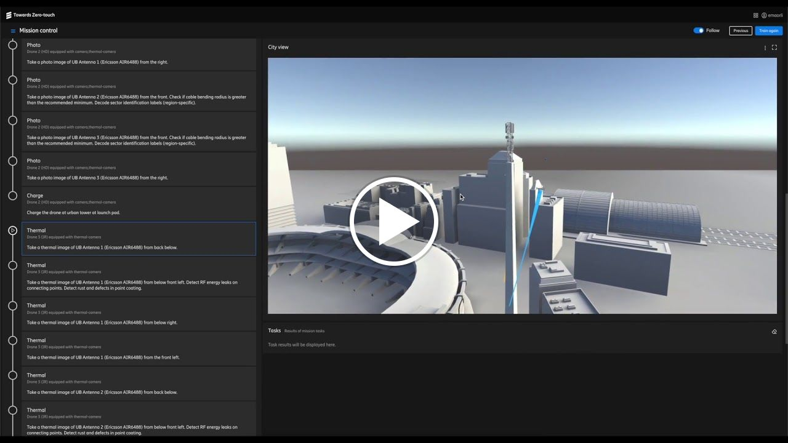

# Droneacharya: Intent-driven strategic-tactical planning

Intent-driven Strategic Tactical Planning (ISTP) is an end-to-end solution in the context of autonomous radio base station inspection across several locations using drones. Our scenario revolves around a human operator in the control room that specifies various points of interest which correspond to several remote sites that need to be inspected by capturing images, thermal images or signal measurements. In Droneacharya, objectives are derived via an Intent-Driven Planning methodology by generalizing goals achieved in demonstrated examples in order to derive plans in new situations. To achieve more efficient planning and replanning, we extend the Strategic-Tactical Planning approach and use it in a real-world scenario. All the components are integrated in an UI facilitating the supervision and feedback from the user as well as visualizing the generated plan in a 3D world built using Unity.
